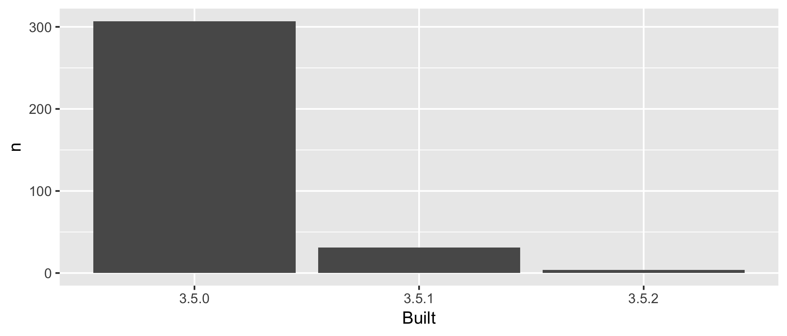

---
output:
  github_document:
    html_preview: true
---

<!-- README.md is generated from README.Rmd. Please edit that file -->


```{r setup, include = FALSE}
knitr::opts_chunk$set(
  collapse = TRUE,
  comment = "#>"
)
library(tidyverse)
library(here)
```

---------

# WTF Packages Report
A repo from the WFT-workshop at RStudio Conf 2019 with Jenny Bryan and Jim Hester
that contains a simple report describing the packages I `r Sys.getenv("USER")`
have on my machine.

## Polished `Pages` URL here
[]()

### Recall what this does
```
git push --set-upstream origin master
```

## Analysis
```{r, echo = FALSE}
# here are the add-on packages
add_ons <- here("data", "add-on-packages.csv") %>% read_csv()
add_ons
```

I have `r nrow(add_ons)` add-on packages installed.

Here's how they break down in terms of which version of R they were built 
under, which is related to how recently they were updated on `CRAN`.

```{r, echo = FALSE, message = FALSE}
# here are the frequencies of the add-on packages
here("data", "add-on-packages-freqtable.csv") %>% read_csv()
```




### Flow of the analysis

Run [R/make-clean.R](R/make-clean.R) to clean out downstream products, i.e.
directories containing the generated `*.csv` and `*.png` files.

Run [R/driver.R](R/driver.R) to re-run the analysis and re-render this `README`.

| Input                         | Script                        | Output                                            |
|-------------------------------|-------------------------------|---------------------------------------------------|
|                               | [R/01_write-installed-packages.R](R/01_write-installed-packages.R) | [data/installed-packages.csv](data/installed-packages.csv)                            |
| [data/installed-packages.csv](data/installed-packages.csv)        | [R/02_wrangle-packages.R](R/02_wrangle-packages.R)         | [data/add-on-packages.csv](data/add-on-packages.csv)<br>[data/add-on-packages-freqtable.csv](data/add-on-packages-freqtable.csv) |
| [data/add-on-packages-freqtable.csv](data/add-on-packages-freqtable.csv) | [R/03_barchart-packages-built.R](R/03_barchart-packages-built.R)  | [figs/built-barchart.png](figs/built-barchart.png)                                |


-----

<details>

<summary>Session info</summary>
```{r}
devtools::session_info()
```

</details>

-------------

Created on `r Sys.Date()` by [Rmarkdown](https://github.com/rstudio/rmarkdown)
(v`r utils::packageVersion("rmarkdown")`) and `r R.version$version.string`.
