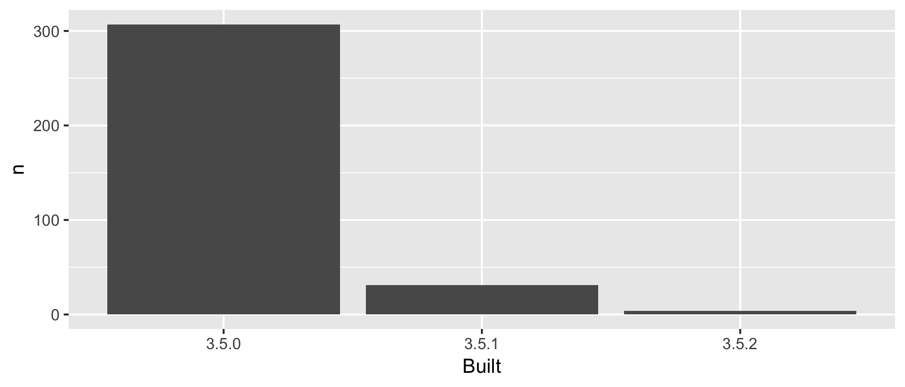

<!-- README.md is generated from README.Rmd. Please edit that file -->

-----

# WTF Packages Report

A repo from the WFT-workshop at RStudio Conf 2019 with Jenny Bryan and
Jim Hester that contains a simple report describing the packages I
sfield have on my machine.

## Polished `GitHub Pages` URL here

<https://stufield.github.io/packages-report/>

### Recall what this does

    git push --set-upstream origin master

## Analysis

    #> Parsed with column specification:
    #> cols(
    #>   Package = col_character(),
    #>   Built = col_character()
    #> )
    #> # A tibble: 342 x 2
    #>    Package    Built
    #>    <chr>      <chr>
    #>  1 abind      3.5.0
    #>  2 acepack    3.5.0
    #>  3 askpass    3.5.2
    #>  4 assertthat 3.5.0
    #>  5 backports  3.5.0
    #>  6 base64enc  3.5.0
    #>  7 bayesplot  3.5.0
    #>  8 bbmle      3.5.0
    #>  9 beanplot   3.5.0
    #> 10 beeswarm   3.5.0
    #> # … with 332 more rows

I have 342 add-on packages installed.

Here’s how they break down in terms of which version of R they were
built under, which is related to how recently they were updated on
`CRAN`.

| Built |   n |  prop |
| :---- | --: | ----: |
| 3.5.0 | 307 | 0.898 |
| 3.5.1 |  31 | 0.091 |
| 3.5.2 |   4 | 0.012 |



### Flow of the analysis

Run [R/make-clean.R](R/make-clean.R) to clean out downstream products,
i.e. directories containing the generated `*.csv` and `*.png` files.

Run [R/driver.R](R/driver.R) to re-run the analysis and re-render this
`README`.

| Input                                                                    | Script                                                              | Output                                                                                                                           |
| ------------------------------------------------------------------------ | ------------------------------------------------------------------- | -------------------------------------------------------------------------------------------------------------------------------- |
|                                                                          | [R/01\_write-installed-packages.R](R/01_write-installed-packages.R) | [data/installed-packages.csv](data/installed-packages.csv)                                                                       |
| [data/installed-packages.csv](data/installed-packages.csv)               | [R/02\_wrangle-packages.R](R/02_wrangle-packages.R)                 | [data/add-on-packages.csv](data/add-on-packages.csv)<br>[data/add-on-packages-freqtable.csv](data/add-on-packages-freqtable.csv) |
| [data/add-on-packages-freqtable.csv](data/add-on-packages-freqtable.csv) | [R/03\_barchart-packages-built.R](R/03_barchart-packages-built.R)   | [figs/built-barchart.png](figs/built-barchart.png)                                                                               |

-----

<details>

<summary>Session info</summary>

``` r
devtools::session_info()
#> ─ Session info ──────────────────────────────────────────────────────────
#>  setting  value                       
#>  version  R version 3.5.1 (2018-07-02)
#>  os       macOS  10.14.2              
#>  system   x86_64, darwin15.6.0        
#>  ui       X11                         
#>  language (EN)                        
#>  collate  en_US.UTF-8                 
#>  ctype    en_US.UTF-8                 
#>  tz       America/Denver              
#>  date     2019-01-20                  
#> 
#> ─ Packages ──────────────────────────────────────────────────────────────
#>  package     * version date       lib source        
#>  assertthat    0.2.0   2017-04-11 [1] CRAN (R 3.5.0)
#>  backports     1.1.3   2018-12-14 [1] CRAN (R 3.5.0)
#>  bindr         0.1.1   2018-03-13 [1] CRAN (R 3.5.0)
#>  bindrcpp    * 0.2.2   2018-03-29 [1] CRAN (R 3.5.0)
#>  broom         0.5.1   2018-12-05 [1] CRAN (R 3.5.0)
#>  callr         3.1.1   2018-12-21 [1] CRAN (R 3.5.0)
#>  cellranger    1.1.0   2016-07-27 [1] CRAN (R 3.5.0)
#>  cli           1.0.1   2018-09-25 [1] CRAN (R 3.5.0)
#>  colorspace    1.3-2   2016-12-14 [1] CRAN (R 3.5.0)
#>  crayon        1.3.4   2017-09-16 [1] CRAN (R 3.5.0)
#>  desc          1.2.0   2018-05-01 [1] CRAN (R 3.5.0)
#>  devtools      2.0.1   2018-10-26 [1] CRAN (R 3.5.1)
#>  digest        0.6.18  2018-10-10 [1] CRAN (R 3.5.0)
#>  dplyr       * 0.7.8   2018-11-10 [1] CRAN (R 3.5.0)
#>  evaluate      0.12    2018-10-09 [1] CRAN (R 3.5.0)
#>  fansi         0.4.0   2018-10-05 [1] CRAN (R 3.5.0)
#>  forcats     * 0.3.0   2018-02-19 [1] CRAN (R 3.5.0)
#>  fs            1.2.6   2018-08-23 [1] CRAN (R 3.5.0)
#>  generics      0.0.2   2018-11-29 [1] CRAN (R 3.5.0)
#>  ggplot2     * 3.1.0   2018-10-25 [1] CRAN (R 3.5.0)
#>  glue          1.3.0   2018-07-17 [1] CRAN (R 3.5.0)
#>  gtable        0.2.0   2016-02-26 [1] CRAN (R 3.5.0)
#>  haven         2.0.0   2018-11-22 [1] CRAN (R 3.5.0)
#>  here        * 0.1     2017-05-28 [1] CRAN (R 3.5.0)
#>  highr         0.7     2018-06-09 [1] CRAN (R 3.5.0)
#>  hms           0.4.2   2018-03-10 [1] CRAN (R 3.5.0)
#>  htmltools     0.3.6   2017-04-28 [1] CRAN (R 3.5.0)
#>  httr          1.4.0   2018-12-11 [1] CRAN (R 3.5.0)
#>  jsonlite      1.6     2018-12-07 [1] CRAN (R 3.5.0)
#>  knitr         1.21    2018-12-10 [1] CRAN (R 3.5.1)
#>  lattice       0.20-38 2018-11-04 [1] CRAN (R 3.5.0)
#>  lazyeval      0.2.1   2017-10-29 [1] CRAN (R 3.5.0)
#>  lubridate     1.7.4   2018-04-11 [1] CRAN (R 3.5.0)
#>  magrittr      1.5     2014-11-22 [1] CRAN (R 3.5.0)
#>  memoise       1.1.0   2017-04-21 [1] CRAN (R 3.5.0)
#>  modelr        0.1.2   2018-05-11 [1] CRAN (R 3.5.0)
#>  munsell       0.5.0   2018-06-12 [1] CRAN (R 3.5.0)
#>  nlme          3.1-137 2018-04-07 [1] CRAN (R 3.5.0)
#>  pillar        1.3.1   2018-12-15 [1] CRAN (R 3.5.0)
#>  pkgbuild      1.0.2   2018-10-16 [1] CRAN (R 3.5.0)
#>  pkgconfig     2.0.2   2018-08-16 [1] CRAN (R 3.5.0)
#>  pkgload       1.0.2   2018-10-29 [1] CRAN (R 3.5.0)
#>  plyr          1.8.4   2016-06-08 [1] CRAN (R 3.5.0)
#>  prettyunits   1.0.2   2015-07-13 [1] CRAN (R 3.5.0)
#>  processx      3.2.1   2018-12-05 [1] CRAN (R 3.5.0)
#>  ps            1.3.0   2018-12-21 [1] CRAN (R 3.5.0)
#>  purrr       * 0.2.5   2018-05-29 [1] CRAN (R 3.5.0)
#>  R6            2.3.0   2018-10-04 [1] CRAN (R 3.5.0)
#>  Rcpp          1.0.0   2018-11-07 [1] CRAN (R 3.5.0)
#>  readr       * 1.3.1   2018-12-21 [1] CRAN (R 3.5.1)
#>  readxl        1.2.0   2018-12-19 [1] CRAN (R 3.5.1)
#>  remotes       2.0.2   2018-10-30 [1] CRAN (R 3.5.0)
#>  rlang         0.3.1   2019-01-08 [1] CRAN (R 3.5.2)
#>  rmarkdown     1.11    2018-12-08 [1] CRAN (R 3.5.0)
#>  rprojroot     1.3-2   2018-01-03 [1] CRAN (R 3.5.0)
#>  rstudioapi    0.8     2018-10-02 [1] CRAN (R 3.5.0)
#>  rvest         0.3.2   2016-06-17 [1] CRAN (R 3.5.0)
#>  scales        1.0.0   2018-08-09 [1] CRAN (R 3.5.0)
#>  sessioninfo   1.1.1   2018-11-05 [1] CRAN (R 3.5.0)
#>  stringi       1.2.4   2018-07-20 [1] CRAN (R 3.5.0)
#>  stringr     * 1.3.1   2018-05-10 [1] CRAN (R 3.5.0)
#>  testthat      2.0.1   2018-10-13 [1] CRAN (R 3.5.0)
#>  tibble      * 2.0.1   2019-01-12 [1] CRAN (R 3.5.2)
#>  tidyr       * 0.8.2   2018-10-28 [1] CRAN (R 3.5.0)
#>  tidyselect    0.2.5   2018-10-11 [1] CRAN (R 3.5.0)
#>  tidyverse   * 1.2.1   2017-11-14 [1] CRAN (R 3.5.0)
#>  usethis       1.4.0   2018-08-14 [1] CRAN (R 3.5.0)
#>  utf8          1.1.4   2018-05-24 [1] CRAN (R 3.5.0)
#>  withr         2.1.2   2018-03-15 [1] CRAN (R 3.5.0)
#>  xfun          0.4     2018-10-23 [1] CRAN (R 3.5.0)
#>  xml2          1.2.0   2018-01-24 [1] CRAN (R 3.5.0)
#>  yaml          2.2.0   2018-07-25 [1] CRAN (R 3.5.0)
#> 
#> [1] /Users/sfield/r_libs
#> [2] /Library/Frameworks/R.framework/Versions/3.5/Resources/library
```

</details>

-----

Created on 2019-01-20 by
[Rmarkdown](https://github.com/rstudio/rmarkdown) (v1.11) and R version
3.5.1 (2018-07-02).
